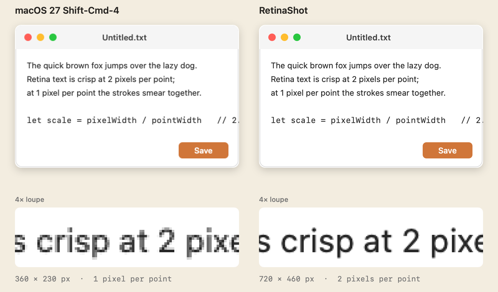
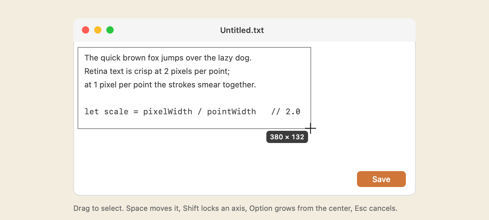

# RetinaShot

Replaces Shift-Cmd-4 on macOS 27, where the built-in tool saves area screenshots at half resolution.

## What Apple broke

macOS 27 rewrote `/usr/sbin/screencapture` on ScreenCaptureKit. Its "selected portion" path asks
`SCScreenshotManager` for a rectangle in points and never scales the output to the display's backing
factor, so on a Retina display a 600×400 pt selection is saved as a 600×400 px file. Window and
full-screen captures take a different path and are still 2x. The file is still tagged 144 dpi, so
it also opens at half size.

The pattern is easy to confirm: every screenshot carries its selection rectangle in Spotlight
metadata (`kMDItemScreenCaptureGlobalRect`, in points). Before the update the pixel size was
exactly twice that on every capture; after it, selections are 1x and window captures are 2x.

  

## What RetinaShot does

- On Shift-Cmd-4 (or Ctrl-Shift-Cmd-4) it puts a transparent panel over every display and shows
  a crosshair. The coordinates, and the selection size while dragging, are rendered into the cursor
  image, so they move with the pointer instead of trailing it.
- On release it captures the whole display through ScreenCaptureKit at the display's native pixel
  size, window shadows included, and crops the selection out of that. The pixels match Apple's own
  full-screen capture of that display, and the PNG is tagged at the display's scale (144 dpi at 2x)
  with the display's color profile, as the built-in tool's were before the update.
- It saves to the Desktop, or to the folder set in the Screenshot app's Options, using Apple's file
  naming and a hidden extension, marks the file as a screenshot for Spotlight and Finder, and puts
  the image on the clipboard as PNG and TIFF.
- A thumbnail rises into the bottom-right corner of the display that was captured. Click to open;
  drag into another app.
- The panels are non-activating, so the app you were using keeps focus and its window shadows.
- With [MXSwipe](https://github.com/mstallone/mxswipe) also running, the two share one menu-bar icon
  and menu through [MenuHub](https://github.com/mstallone/menuhub), with one Check for Updates… for both.

| Key | While selecting |
|---|---|
| Drag | Select |
| Space (held) | Move the selection |
| Shift | Lock width or height |
| Option | Resize from the center |
| Space (before dragging) | Switch to Apple's window picker; its window path is unaffected |
| Escape | Cancel |

  

Settings are read from Apple's `com.apple.screencapture` domain, so the Screenshot app's Options
menu keeps working: `location`, `name`, `include-date`, `type` (png, jpg, tiff), `disable-shadow`,
and `show-thumbnail`.

### Permission

Every process that reads screen pixels needs Screen Recording; Apple's own shortcuts are exempt only
because they run inside a system process. RetinaShot asks once. If the switch is on but captures
fail, the stored entry no longer matches the app's signature: Option-click the menu-bar icon and
choose Reset Screen Recording Permission.

### Private calls

Two undocumented calls are used, isolated in `Sources/RetinaShot/Private.swift`:

- `CGSSetConnectionProperty(…, "SetsCursorInBackground")` lets a non-active app set the pointer.
  Without it the crosshair would require activating RetinaShot, which deactivates your window.
  If a future macOS ignores it, the crosshair stops appearing and nothing else changes.
- `MDItemSetAttribute` writes `kMDItemIsScreenCapture` and the selection rectangle, as the built-in
  tool does. If it fails, the file is still saved, just not indexed as a screenshot.

## Install

Download `RetinaShot-<version>-macOS.zip` from the [latest release](https://github.com/mstallone/retinashot/releases/latest),
unzip, and move RetinaShot.app to /Applications. It is a universal binary, signed with Developer ID,
notarized, and requires macOS 27. From 1.5.0 it updates itself through [Sparkle](https://sparkle-project.org);
1.4.0 and earlier are replaced by hand.

Then turn off the built-in shortcut so RetinaShot can take it: run `Scripts/install-shortcuts.sh`
from a checkout, or untick "Save picture of selected area as a file" and its clipboard variant under
System Settings › Keyboard › Keyboard Shortcuts › Screenshots. Shift-Cmd-3 and Shift-Cmd-5 are not
touched. `uninstall.sh` reverses both steps.

Once Apple fixes the bug (a fresh Shift-Cmd-4 file will be twice its selection size), run
`uninstall.sh` to hand the shortcut back.

## Building

`./build.sh` builds with SwiftPM, signs with an Apple Development identity so the Screen Recording
grant survives rebuilds, installs to /Applications, disables the built-in shortcut, and launches.
It refuses to overwrite a release build unless given `--replace`.

    Sources/RetinaShot/main.swift        app lifecycle, menu, capture flow, permission dialog
    Sources/RetinaShot/Selection.swift   overlay panels, rubber-band view, cursor with badge
    Sources/RetinaShot/Capture.swift     ScreenCaptureKit capture, crop, save, clipboard
    Sources/RetinaShot/Thumbnail.swift   floating preview
    Sources/RetinaShot/HotKeys.swift     Carbon global hot keys
    Sources/RetinaShot/Preferences.swift Apple's com.apple.screencapture settings
    Sources/RetinaShot/Permission.swift  Screen Recording permission helpers
    Sources/RetinaShot/Private.swift     the two private calls above
    Resources/Info.plist                 bundle template; the version is stamped at build time
    Tools/make-icon.swift                renders AppIcon.icns
    Tools/make-readme-assets.swift       renders the images in this README from synthetic content
    Tools/export-identity.swift          exports a signing identity from the keychain as a .p12
    Scripts/build-app.sh                 stages RetinaShot.app from a built binary, with Sparkle
    Scripts/sign.sh                      signs the app and Sparkle inside out
    Scripts/build-release.sh             CI: universal build, Developer ID, notarize, staple, zip
    Scripts/generate-appcast.sh          CI: signed Sparkle appcast for the release
    Scripts/install-shortcuts.sh         hands Shift-Cmd-4 to RetinaShot
    Scripts/set-release-secrets.sh       one-time GitHub Actions secret setup

## Releasing

The tag is the version. Pushing `vMAJOR.MINOR.PATCH` runs the Release workflow: universal build,
Developer ID signature with hardened runtime and timestamp, notarization, stapling, Gatekeeper
check, then a GitHub Release with the zip, its SHA-256, and a signed Sparkle `appcast.xml`.

    git tag v1.2.2 && git push origin v1.2.2

Secrets, set once with `Scripts/set-release-secrets.sh <issuer-id>` (it exports the Developer ID
identity and the Sparkle key from the login keychain, and reads the App Store Connect key from
`~/.appstoreconnect/private_keys`):

| Secret | Contents |
|---|---|
| `DEVELOPER_ID_CERTIFICATE_BASE64` | base64 of the Developer ID Application `.p12` |
| `DEVELOPER_ID_CERTIFICATE_PASSWORD` | its export password |
| `APPLE_NOTARY_PRIVATE_KEY_BASE64` | base64 of the App Store Connect API key (`.p8`) |
| `APPLE_NOTARY_KEY_ID` | that key's ID |
| `APPLE_NOTARY_ISSUER_ID` | the App Store Connect issuer ID |
| `SPARKLE_ED_PRIVATE_KEY` | the EdDSA key from Sparkle's `generate_keys --account cc.stallone.retinashot` |

The public half of the Sparkle key is `SUPublicEDKey` in `Resources/Info.plist`. Installed copies accept
only updates signed with that key and the same Developer ID team, so keep a backup of both.

## License

MIT. See [LICENSE](LICENSE).
