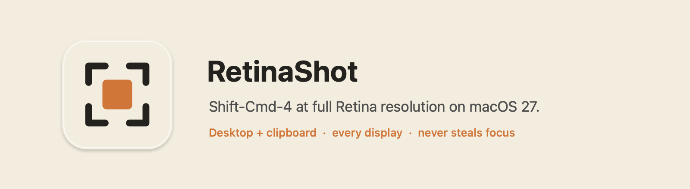

# RetinaShot

A menu-bar replacement for Shift-Cmd-4 on macOS 27.

  

**Why it exists.** macOS 27 rewrote `/usr/sbin/screencapture` on ScreenCaptureKit, and its
"selected portion" path saves 1 pixel per point (a 600×400 pt selection becomes a 600×400 px file
tagged 144 dpi) while window and full-screen captures are still 2x. RetinaShot captures the whole
display at native resolution and crops, so selections come out at full Retina resolution again.

  

**What it does**

- Shift-Cmd-4 (or Ctrl-Shift-Cmd-4): crosshair with live coordinates on every display. Drag to select.
  Space while dragging moves the selection, Shift locks an axis, Option resizes from the center,
  Escape cancels. Pressing Space before dragging switches to Apple's window picker, whose window
  path is unaffected by the bug.
- Saves the file to the Desktop (or the folder set in the Screenshot app's Options) with Apple's
  naming, tags it as a screenshot for Spotlight and Finder, and copies it to the clipboard.
- Slides in a floating thumbnail on the display that was captured; click it to open, drag it into
  another app. Honors "Show Floating Thumbnail", file type and window-shadow settings from Apple's
  Options menu.
- Never activates itself, so the app you are using keeps focus and its window shadows.

  

The illustrations are rendered from synthetic content by `Tools/make-readme-assets.swift`.

**Permission.** Every app that reads screen pixels needs Screen Recording; Apple's shortcuts skip it
only because they run inside the system. If the switch shows on but captures fail, Option-click the
menu-bar icon and choose Reset Screen Recording Permission.

## Layout

    Sources/RetinaShot/main.swift        app lifecycle, menu, capture flow, permission dialog
    Sources/RetinaShot/Selection.swift   overlay panels and the rubber-band view
    Sources/RetinaShot/Capture.swift     ScreenCaptureKit capture, crop, save, clipboard
    Sources/RetinaShot/Thumbnail.swift   floating preview
    Sources/RetinaShot/HotKeys.swift     Carbon global hot keys
    Sources/RetinaShot/Preferences.swift Apple's com.apple.screencapture settings
    Sources/RetinaShot/Permission.swift  Screen Recording permission helpers
    Sources/RetinaShot/Private.swift     two private calls: background cursor, Spotlight screenshot tags
    Resources/Info.plist                 bundle template (version and build are stamped at build time)
    Tools/make-icon.swift                renders AppIcon.icns
    Tools/make-readme-assets.swift       renders the README illustrations
    Scripts/build-app.sh                 stages RetinaShot.app from a built binary
    Scripts/build-release.sh             CI: universal build, Developer ID, notarize, staple, zip
    Scripts/install-shortcuts.sh         hands Shift-Cmd-4 to RetinaShot
    Scripts/set-release-secrets.sh       one-time GitHub Actions secret setup
    Tools/export-identity.swift          exports a signing identity from the keychain as .p12

## Local development

`./build.sh` builds with SwiftPM, signs with your Apple Development identity (so the Screen Recording
grant survives rebuilds), installs to /Applications, disables the built-in shortcut, and launches.
`./uninstall.sh` removes everything and hands Shift-Cmd-4 back to macOS.

## Releasing

The tag is the version. Push a `vMAJOR.MINOR.PATCH` tag and the Release workflow builds a universal
binary, signs it with the NextByte Developer ID (hardened runtime, secure timestamp), notarizes and
staples it, verifies it with Gatekeeper, and publishes `RetinaShot-<version>-macOS.zip` and its
SHA-256 to a GitHub Release. `CFBundleVersion` is the commit count.

    git tag v1.2.0 && git push origin v1.2.0

Required repository secrets (the same material as mx-master-input and runway), set once with
`Scripts/set-release-secrets.sh <issuer-id>`. It exports the Developer ID identity straight from
your login keychain (macOS asks once to allow key access) and picks up the App Store Connect key
from `~/.appstoreconnect/private_keys`; pass a `.p8` and `.p12` path to use other files.

| Secret | What it is |
|---|---|
| `DEVELOPER_ID_CERTIFICATE_BASE64` | base64 of the Developer ID Application `.p12` (team 8KZBNZJBAX) |
| `DEVELOPER_ID_CERTIFICATE_PASSWORD` | the password set when exporting that `.p12` |
| `APPLE_NOTARY_PRIVATE_KEY_BASE64` | base64 of the App Store Connect API private key (`.p8`) |
| `APPLE_NOTARY_KEY_ID` | the App Store Connect API key ID |
| `APPLE_NOTARY_ISSUER_ID` | the App Store Connect API issuer ID |

Install a release by unzipping and dragging RetinaShot.app to /Applications; the shortcut takeover is
`Scripts/install-shortcuts.sh` (or untick "Save picture of selected area as a file" under
System Settings › Keyboard › Keyboard Shortcuts › Screenshots).

**Once Apple fixes the bug** (check: a fresh Shift-Cmd-4 file should be twice its selection size),
run `./uninstall.sh` to hand the shortcut back.

## License

MIT. See [LICENSE](LICENSE).
